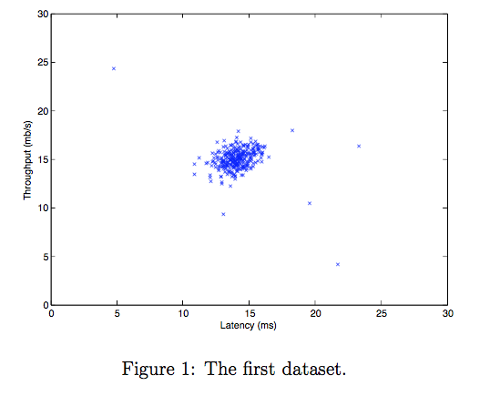
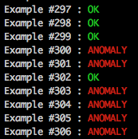

Anomaly Detection In C++
===

My implementation in c++ of an anomaly detection project from the ML course by Andrew Ng on Coursera.
Subject can be found [here](https://github.com/mtrazzi/anomaly-detection-in-cpp/blob/master/resources/subject.pdf)

For a given threshold epsilon, we say that an example is an anomaly if probability(example) < epsilon.

Given a dataset, the algorithm classifies the examples between anomaly/non-anomaly after having computed the best threshold epsilon.

The threshold is calculated after having computed the [F1Score](https://en.wikipedia.org/wiki/F1_score).

The probability distribution is estimated by considering a [Multavariate Normal Distribution](https://en.wikipedia.org/wiki/Multivariate_normal_distribution).

## Dependencies

You need to have [Eigen3](http://eigen.tuxfamily.org/index.php?title=Main_Page#Documentation) library installed.

## Build

`git clone https://github.com/mtrazzi/anomaly-detection-in-cpp.git repo_name`

`cd repo_name`

`mkdir build`

`cd build`

`cmake ..`

`make`

## Usage

`` ./threshold dataset{1|2}``

## Results

### What it classifies in 2d

### My Output

